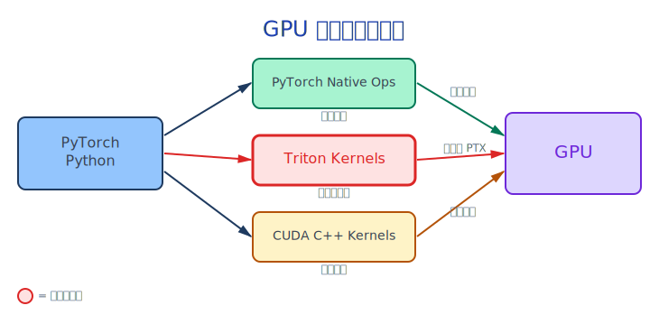
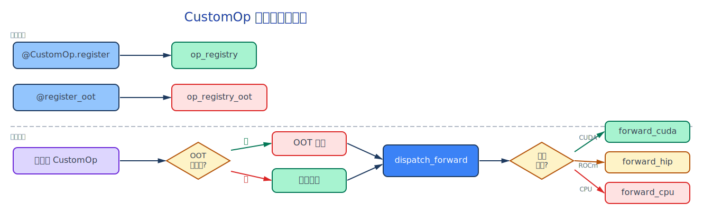

---
jupyter:
  jupytext:
    text_representation:
      extension: .md
      format_name: markdown
      format_version: '1.3'
      jupytext_version: 1.19.1
  kernelspec:
    display_name: Python 3
    language: python
    name: python3
---

# 00 - vLLM 中的 Triton 算子：为什么需要自定义算子？

> **本 Notebook 涵盖内容**
> - vLLM 的算子架构全景
> - Triton 在 vLLM 中的角色
> - CustomOp 注册系统概览
> - 三种常见场景：自定义算子、融合算子、算子替换
> - 本教程的学习路线图


## 1. 为什么 LLM 推理需要自定义算子？

大语言模型推理面临一个核心矛盾：**模型越来越大，但用户期望的延迟越来越低**。

```
用户请求 → Tokenize → N 层 Transformer → Decode → 返回文本
                      ↑
              每一层都包含: Attention + FFN + LayerNorm
              每个操作都涉及 GPU 上的 kernel 调用
```

标准 PyTorch 实现的问题：
1. **Kernel Launch Overhead**: 每个小操作都需要一次 GPU kernel 启动
2. **内存带宽瓶颈**: 中间结果反复从 GPU 显存读写（Memory-bound）
3. **缺少特化优化**: 通用算子无法利用 LLM 推理的特定模式

**举个生活中的类比**：想象你在快餐店点餐。标准 PyTorch 就像每道菜分别下单、分别制作、分别送到你桌上。自定义融合算子就像告诉厨房「我要一个套餐」，厨房一次性做好所有菜一起送出来——减少了排队和传菜的次数。


## 2. Triton：GPU 编程的「中间层」



> *图注：Triton 处于 PyTorch Native Ops（简单但慢）和 CUDA C++（最高性能）之间，提供了性能与开发效率的最佳平衡点。红色高亮部分是本教程的重点。*


| 维度 | PyTorch Native | **Triton** | CUDA C++ |
|------|---------------|-----------|----------|
| 开发效率 | 最高 | **高** | 低 |
| 性能 | 一般 | **好** | 最好 |
| 调试难度 | 容易 | **中等** | 困难 |
| 可移植性 | 最好 | **好（AMD/NVIDIA）** | 仅 NVIDIA |
| 学习曲线 | 平缓 | **中等** | 陡峭 |

Triton 的核心优势：**用 Python 语法编写 GPU kernel，由编译器自动处理内存合并、寄存器分配和指令调度**。


## 3. vLLM 的算子架构

vLLM 使用了一套优雅的分层架构来管理自定义算子：

<!-- #region -->
### 3.1 CustomOp 基类

```python
# vllm/model_executor/custom_op.py

class CustomOp(nn.Module):
    """所有自定义算子的基类，提供平台自动分发"""

    def forward_native(self, *args, **kwargs):
        """PyTorch 原生实现（可用于 torch.compile）"""
        raise NotImplementedError

    def forward_cuda(self, *args, **kwargs):
        """CUDA/Triton 优化实现"""
        raise NotImplementedError

    def forward_hip(self, *args, **kwargs):
        """AMD ROCm 实现（默认 fallback 到 forward_cuda）"""
        return self.forward_cuda(*args, **kwargs)

    def forward_xpu(self, *args, **kwargs):
        """Intel XPU 实现"""
        return self.forward_native(*args, **kwargs)

    def dispatch_forward(self, compile_native):
        """根据当前平台自动选择实现"""
        if current_platform.is_rocm():
            return self.forward_hip
        elif current_platform.is_cuda():
            return self.forward_cuda
        # ... 更多平台
```

这个设计的精髓：**一个算子定义，多平台自动分发**。
<!-- #endregion -->

<!-- #region -->
### 3.2 算子注册系统

```python
# 全局注册表
op_registry: dict[str, type[CustomOp]] = {}        # 内部算子
op_registry_oot: dict[str, type[CustomOp]] = {}     # 外部（Out-of-Tree）算子

# 注册内部算子
@CustomOp.register("silu_and_mul")
class SiluAndMul(CustomOp):
    ...

# 注册外部算子（替换已有实现）
@CustomOp.register_oot(name="SiluAndMul")
class MySiluAndMul(SiluAndMul):
    def forward_cuda(self, x):
        # 我的自定义 Triton 实现
        ...
```

注册机制的工作流程：



> *图注：注册分为内部注册（@CustomOp.register → op_registry）和外部注册（@register_oot → op_registry_oot）。实例化时优先检查 OOT 注册，然后通过 dispatch_forward 根据当前平台选择具体实现。*
<!-- #endregion -->

## 4. vLLM 中 Triton 算子的实际分布

vLLM 代码库中包含 **188+ 个 Triton JIT kernel** 和 **22+ 个 Autotune kernel**，分布在以下领域：

| 类别 | Kernel 数量 | 典型示例 | 位置 |
|------|-----------|---------|------|
| Attention | 10+ | decode_attention, prefill_attention | `vllm/v1/attention/ops/` |
| 激活函数 | 5+ | swiglustep_and_mul | `vllm/model_executor/layers/activation.py` |
| MoE 路由 | 8+ | fused_moe_kernel | `vllm/model_executor/layers/fused_moe/` |
| LoRA | 6+ | lora_expand, lora_shrink | `vllm/lora/ops/triton_ops/` |
| 量化 | 10+ | scaled_mm | `vllm/model_executor/layers/quantization/` |
| 采样 | 3+ | topk_topp | `vllm/v1/sample/ops/` |
| Mamba/SSM | 15+ | ssd_chunk_scan | `vllm/model_executor/layers/mamba/ops/` |
| 线性注意力 | 20+ | fused_recurrent | `vllm/model_executor/layers/fla/ops/` |


## 5. 本教程的三个实战场景

我们将通过三个递进的场景，带你从零掌握在 vLLM 中使用 Triton 的全部技能：

### 场景 1: 添加自定义算子（Notebook 01-02）
> 「我想写一个新的 Triton kernel，并让 vLLM 能调用它」

- 编写 Triton kernel 基础
- 通过 `CustomOp.register` 注册到 vLLM
- 与 PyTorch native 实现对比验证

### 场景 2: 添加融合算子（Notebook 03-04）
> 「我想把 Activation + Multiplication 融合成一个 kernel 来减少内存带宽」

- 分析内存带宽瓶颈
- 编写融合 Triton kernel
- 性能对比：融合 vs 非融合

### 场景 3: 替换模型的算子实现（Notebook 05-06）
> 「我想用自己的 Triton 实现替换 Llama 模型中的 RMSNorm / SiluAndMul」

- 使用 OOT (Out-of-Tree) 注册机制
- 替换 Llama 模型使用的算子
- 端到端集成测试


## 6. 运行环境

在开始之前，确保你有以下环境：

```python
import sys
import torch

print(f"Python: {sys.version}")
print(f"PyTorch: {torch.__version__}")
print(f"CUDA available: {torch.cuda.is_available()}")
if torch.cuda.is_available():
    print(f"CUDA version: {torch.version.cuda}")
    print(f"GPU: {torch.cuda.get_device_name(0)}")
    print(f"GPU Memory: {torch.cuda.get_device_properties(0).total_mem / 1024**3:.1f} GB")

try:
    import triton
    print(f"Triton: {triton.__version__}")
except ImportError:
    print("Triton: NOT INSTALLED - please install with: pip install triton")
```

## 7. 源码映射表

| 本教程 | vLLM 原始源码 | 说明 |
|--------|-------------|------|
| Notebook 01: Triton 基础 | `vllm/triton_utils/__init__.py` | Triton 导入与兼容性处理 |
| Notebook 02: 自定义算子 | `vllm/model_executor/custom_op.py` | CustomOp 基类与注册机制 |
| Notebook 03: 融合算子 | `vllm/model_executor/layers/activation.py:26-74` | _swiglustep_and_mul_kernel |
| Notebook 04: 性能分析 | `vllm/model_executor/layers/layernorm.py:56-74` | fused_add_rms_norm |
| Notebook 05: 算子替换 | `vllm/model_executor/models/llama.py` | LlamaMLP, LlamaAttention |
| Notebook 06: 集成测试 | `tests/plugins/` | OOT 插件测试示例 |


## 下一步

进入 [01-triton-kernel-basics.ipynb](01-triton-kernel-basics.ipynb) 开始学习 Triton kernel 的编写基础。
