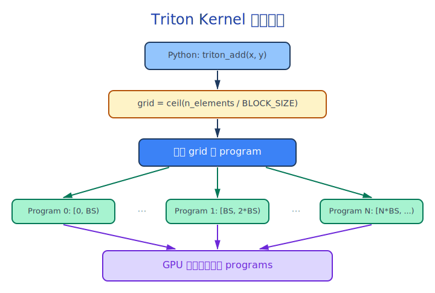

---
jupyter:
  jupytext:
    text_representation:
      extension: .md
      format_name: markdown
      format_version: '1.3'
      jupytext_version: 1.19.1
  kernelspec:
    display_name: triton_tutorial
    language: python
    name: python3
---

# 01 - Triton Kernel 基础：从 Python 到 GPU

> **本 Notebook 涵盖内容**
> - Triton 编程模型：program_id, BLOCK_SIZE, mask
> - 编写第一个 Triton kernel: 向量加法
> - 理解 Triton 的内存访问模式
> - 对比 PyTorch native 实现的性能
> - vLLM 中 Triton 的导入与兼容性处理

**运行示例**：我们用一个简单的 ReLU 激活函数作为贯穿全教程的示例，从最简单的向量操作开始，逐步扩展到融合算子和模型级替换。


## 1. 先感受一下 PyTorch 的「慢」

在 GPU 上执行一系列小操作时，每个操作都会触发一次 kernel launch。让我们先用 PyTorch 的标准方式实现 SiLU 激活函数并测量开销：

```python
import torch
import torch.nn.functional as F
import time

# 确保我们在 GPU 上
assert torch.cuda.is_available(), "This tutorial requires a CUDA GPU"
device = torch.device("cuda")

# 模拟 LLM 推理中的 hidden_states
# Llama-7B: hidden_size=4096, 典型 batch: 1-128 tokens
x = torch.randn(128, 4096, device=device, dtype=torch.float16)

# PyTorch native SiLU: 两个独立操作
# 1. sigmoid(x) — 一次 kernel launch
# 2. x * sigmoid(x) — 又一次 kernel launch
def pytorch_silu(x):
    return F.silu(x)

# 预热
for _ in range(10):
    _ = pytorch_silu(x)
torch.cuda.synchronize()

# 计时
start = time.perf_counter()
for _ in range(100):
    _ = pytorch_silu(x)
torch.cuda.synchronize()
elapsed = time.perf_counter() - start

print(f"PyTorch SiLU: {elapsed*1000:.2f} ms for 1000 iterations")
print(f"Per iteration: {elapsed*1000/100:.4f} ms")
print(f"Shape: {x.shape}, dtype: {x.dtype}")
```

## 2. Triton 编程模型

Triton 的核心思想：**以 Block 为单位操作数据**，而不是像 CUDA 那样以单个线程为单位。

```
CUDA 思维:    每个线程处理 1 个元素
Triton 思维:  每个 program 处理 BLOCK_SIZE 个元素
```

**生活类比**：CUDA 就像一个快递站有 1000 个快递员，每人送 1 个包裹。Triton 就像有 100 个快递员，每人送 10 个包裹——减少了管理开销，每个人做更多事。

关键概念：
- `tl.program_id(axis=0)`：当前 program 的 ID（类似 CUDA 的 blockIdx）
- `BLOCK_SIZE`：每个 program 处理的元素数量
- `tl.arange(0, BLOCK_SIZE)`：生成连续的偏移量数组
- `mask`：防止越界访问
- `tl.load / tl.store`：从显存读写数据


## 3. 第一个 Triton Kernel：向量加法

让我们从最简单的操作开始：

```python
import triton
import triton.language as tl

@triton.jit
def add_kernel(
    x_ptr,      # 第一个输入张量的指针
    y_ptr,      # 第二个输入张量的指针
    output_ptr, # 输出张量的指针
    n_elements, # 总元素数
    BLOCK_SIZE: tl.constexpr,  # 编译时常量：每个 program 处理多少元素
):
    # -- 第 1 步：确定当前 program 处理哪些元素 --
    pid = tl.program_id(axis=0)  # 当前 program 的 ID
    block_start = pid * BLOCK_SIZE
    offsets = block_start + tl.arange(0, BLOCK_SIZE)  # 当前 block 的偏移

    # -- 第 2 步：创建 mask 防止越界 --
    mask = offsets < n_elements

    # -- 第 3 步：加载数据 --
    x = tl.load(x_ptr + offsets, mask=mask)
    y = tl.load(y_ptr + offsets, mask=mask)

    # -- 第 4 步：计算 --
    output = x + y

    # -- 第 5 步：写回结果 --
    tl.store(output_ptr + offsets, output, mask=mask)


def triton_add(x: torch.Tensor, y: torch.Tensor) -> torch.Tensor:
    """Triton 向量加法的 Python 包装函数"""
    output = torch.empty_like(x)
    n_elements = x.numel()

    # 计算需要多少个 program（grid）
    grid = lambda meta: (triton.cdiv(n_elements, meta['BLOCK_SIZE']),)

    # 启动 kernel
    add_kernel[grid](x, y, output, n_elements, BLOCK_SIZE=1024)
    return output


# 测试
x = torch.randn(1024, device=device)
y = torch.randn(1024, device=device)
result_triton = triton_add(x, y)
result_pytorch = x + y

print(f"Max error: {(result_triton - result_pytorch).abs().max().item():.2e}")
assert torch.allclose(result_triton, result_pytorch, atol=1e-5)
print("Triton add kernel: PASSED!")
```

### 3.1 kernel 启动流程详解



$$\text{grid\_size} = \lceil \frac{n\_elements}{BLOCK\_SIZE} \rceil$$

**数值示例**：如果 n_elements = 4096, BLOCK_SIZE = 1024，则 grid_size = 4。也就是说有 4 个 program 并行处理数据。


## 4. 编写 SiLU 激活 Triton Kernel

SiLU (Sigmoid Linear Unit) 的公式：

$$\text{SiLU}(x) = x \cdot \sigma(x) = x \cdot \frac{1}{1 + e^{-x}}$$

**数值示例**：当 x = 2.0 时：
- $\sigma(2.0) = \frac{1}{1 + e^{-2}} = \frac{1}{1 + 0.135} = 0.881$
- $\text{SiLU}(2.0) = 2.0 \times 0.881 = 1.762$

**生活类比**：SiLU 就像一个带「自信度加权」的门控——输入值越大（越自信），通过的比例越接近 100%；输入值接近 0（不确定），通过的比例接近 50%；输入值很负（反向信号），几乎全部被阻挡。

```python
@triton.jit
def silu_kernel(
    x_ptr,
    output_ptr,
    n_elements,
    BLOCK_SIZE: tl.constexpr,
):
    pid = tl.program_id(axis=0)
    offsets = pid * BLOCK_SIZE + tl.arange(0, BLOCK_SIZE)
    mask = offsets < n_elements

    # 加载数据，转换为 float32 以提高数值精度
    x = tl.load(x_ptr + offsets, mask=mask).to(tl.float32)

    # SiLU 计算：x * sigmoid(x)
    result = x * tl.sigmoid(x)

    # 转回原始 dtype 并存储
    result = result.to(x_ptr.dtype.element_ty)
    tl.store(output_ptr + offsets, result, mask=mask)


def triton_silu(x: torch.Tensor) -> torch.Tensor:
    output = torch.empty_like(x)
    n_elements = x.numel()
    grid = lambda meta: (triton.cdiv(n_elements, meta['BLOCK_SIZE']),)
    silu_kernel[grid](x, output, n_elements, BLOCK_SIZE=1024)
    return output


# 验证正确性
x = torch.randn(128, 4096, device=device, dtype=torch.float16)
result_triton = triton_silu(x)
result_pytorch = F.silu(x)

max_err = (result_triton - result_pytorch).abs().max().item()
print(f"Max error: {max_err:.2e}")
assert max_err < 1e-2, f"Error too large: {max_err}"
print("SiLU Triton kernel: PASSED!")
```

<!-- #region -->
### 4.1 数值精度注意事项

注意我们在 kernel 中做了 `.to(tl.float32)` 转换：

```python
x = tl.load(x_ptr + offsets, mask=mask).to(tl.float32)  # fp16 -> fp32
result = x * tl.sigmoid(x)                                # 在 fp32 精度下计算
result = result.to(x_ptr.dtype.element_ty)                 # fp32 -> fp16 存回
```

这是 vLLM 中的标准做法（参见 `activation.py:43-51`）。fp16 的精度有限（最小可表示的正数约为 $6 \times 10^{-5}$），sigmoid 中的指数运算在极端值时容易溢出。

> **Source**: vllm/model_executor/layers/activation.py:43-51
<!-- #endregion -->

## 5. 性能对比：Triton vs PyTorch

```python
import triton

# 性能基准测试
@triton.testing.perf_report(
    triton.testing.Benchmark(
        x_names=['size'],
        x_vals=[2**i for i in range(12, 22)],  # 4K to 2M elements
        line_arg='provider',
        line_vals=['pytorch', 'triton'],
        line_names=['PyTorch', 'Triton'],
        styles=[('blue', '-'), ('red', '-')],
        ylabel='GB/s',
        plot_name='silu-performance',
        args={},
    )
)
def benchmark(size, provider):
    x = torch.randn(size, device=device, dtype=torch.float16)
    quantiles = [0.5, 0.2, 0.8]

    if provider == 'pytorch':
        ms, min_ms, max_ms = triton.testing.do_bench(
            lambda: F.silu(x), quantiles=quantiles
        )
    else:
        ms, min_ms, max_ms = triton.testing.do_bench(
            lambda: triton_silu(x), quantiles=quantiles
        )

    # 计算带宽: 读 x + 写 output = 2 * size * 2 bytes (fp16)
    gbps = lambda ms: 2 * size * 2 / ms * 1e-6
    return gbps(ms), gbps(max_ms), gbps(min_ms)

# 运行 benchmark（会生成图表）
try:
    benchmark.run(show_plots=True, print_data=True)
except Exception as e:
    print(f"Benchmark visualization skipped: {e}")
    # 简单的手动计时
    sizes = [4096, 65536, 524288, 2097152]
    for size in sizes:
        x = torch.randn(size, device=device, dtype=torch.float16)
        t_pt = triton.testing.do_bench(lambda: F.silu(x))
        t_tr = triton.testing.do_bench(lambda: triton_silu(x))
        print(f"Size={size:>8d} | PyTorch: {t_pt:.4f}ms | Triton: {t_tr:.4f}ms | Speedup: {t_pt/t_tr:.2f}x")
```

<!-- #region -->
## 6. vLLM 的 Triton 兼容性处理

vLLM 需要在没有 GPU 的环境下也能加载模块（比如文档构建、类型检查）。它通过一个巧妙的占位符系统实现了这一点：

```python
# vllm/triton_utils/__init__.py
from vllm.triton_utils.importing import HAS_TRITON

if TYPE_CHECKING or HAS_TRITON:
    import triton
    import triton.language as tl
else:
    triton = TritonPlaceholder()    # 假的 triton 模块
    tl = TritonLanguagePlaceholder()  # 假的 tl 模块
```

**TritonPlaceholder** 提供了 `@triton.jit` 等装饰器的空实现，使得带有 `@triton.jit` 的函数在没有 Triton 的环境中不会报错，只是不会被编译成 GPU kernel。

```python
# 在 vLLM 中导入 triton 的标准方式:
from vllm.triton_utils import tl, triton  # 而不是 import triton

@triton.jit  # 如果没有 Triton，这只是一个 no-op 装饰器
def my_kernel(...):
    ...
```

> **Source**: vllm/triton_utils/importing.py:74-104
<!-- #endregion -->

## 7. Triton 的 2D Grid：处理矩阵

LLM 中大多数操作是矩阵运算。Triton 支持多维 grid 来自然地映射矩阵操作：

```python
@triton.jit
def silu_2d_kernel(
    x_ptr,
    output_ptr,
    x_stride,   # 行步长
    o_stride,   # 输出行步长
    n_cols,     # 列数
    BLOCK_SIZE: tl.constexpr,
):
    # 2D grid: program_id(0) = 行索引, program_id(1) = 列 block 索引
    row = tl.program_id(axis=0)
    col_block = tl.program_id(axis=1)

    col_offsets = col_block * BLOCK_SIZE + tl.arange(0, BLOCK_SIZE)
    mask = col_offsets < n_cols

    # 通过 stride 计算全局偏移
    x_ptrs = x_ptr + row * x_stride + col_offsets
    o_ptrs = output_ptr + row * o_stride + col_offsets

    x = tl.load(x_ptrs, mask=mask).to(tl.float32)
    result = x * tl.sigmoid(x)
    tl.store(o_ptrs, result.to(x_ptr.dtype.element_ty), mask=mask)


def triton_silu_2d(x: torch.Tensor) -> torch.Tensor:
    assert x.ndim == 2, "Input must be 2D"
    output = torch.empty_like(x)
    n_rows, n_cols = x.shape
    BLOCK_SIZE = 1024

    # 2D grid: (行数, 每行需要的 block 数)
    grid = (n_rows, triton.cdiv(n_cols, BLOCK_SIZE))

    silu_2d_kernel[grid](
        x, output,
        x.stride(0), output.stride(0),
        n_cols,
        BLOCK_SIZE=BLOCK_SIZE,
    )
    return output


# 验证 2D 版本
x = torch.randn(128, 4096, device=device, dtype=torch.float16)
result = triton_silu_2d(x)
expected = F.silu(x)
max_err = (result - expected).abs().max().item()
print(f"2D SiLU - Max error: {max_err:.2e}")
assert max_err < 1e-2
print("2D SiLU Triton kernel: PASSED!")

print(f"\nGrid dimensions: ({x.shape[0]}, {triton.cdiv(x.shape[1], 1024)})")
print(f"Total programs: {x.shape[0] * triton.cdiv(x.shape[1], 1024)}")
```

<!-- #region -->
### 7.1 vLLM 中的 2D Grid 模式

vLLM 的 `_swiglustep_and_mul_kernel` 正是使用了这种 2D grid 模式：

```python
# vllm/model_executor/layers/activation.py:36-37
i = tl.program_id(axis=0).to(tl.int64)  # 行索引（batch 维度）
j = tl.program_id(axis=1)                # 列 block 索引

# activation.py:63-64 (grid 函数)
def grid(meta):
    return (b, triton.cdiv(d, meta["BLOCK_SIZE"]))
```

这种模式在 vLLM 中非常常见，因为 LLM 推理的数据形状总是 (num_tokens, hidden_size)。

> **Source**: vllm/model_executor/layers/activation.py:26-74
<!-- #endregion -->

## 8. 本章小结

| 概念 | 说明 |
|------|------|
| `@triton.jit` | 将 Python 函数编译为 GPU kernel |
| `tl.program_id(axis)` | 获取当前 program 的 ID |
| `BLOCK_SIZE: tl.constexpr` | 编译时常量，决定每个 program 处理的元素数 |
| `mask` | 防止越界访问 |
| `tl.load / tl.store` | 从显存读写数据 |
| `.to(tl.float32)` | 提高中间计算精度 |
| 2D Grid | 自然映射矩阵操作 |

## 源码映射表

| 本教程实现 | vLLM 原始源码 | 章节 |
|-----------|-------------|------|
| `silu_kernel` | `activation.py:26-52 (_swiglustep_and_mul_kernel)` | 4 |
| `triton_silu_2d` | `activation.py:55-74 (swiglustep_and_mul_triton)` | 7 |
| Triton 导入 | `triton_utils/__init__.py` | 6 |
| Placeholder | `triton_utils/importing.py:74-104` | 6 |

## 下一步

在 [02-custom-op-registration.ipynb](02-custom-op-registration.ipynb) 中，我们将学习如何把 Triton kernel 注册为 vLLM 的 CustomOp，使其能被模型自动调用。
